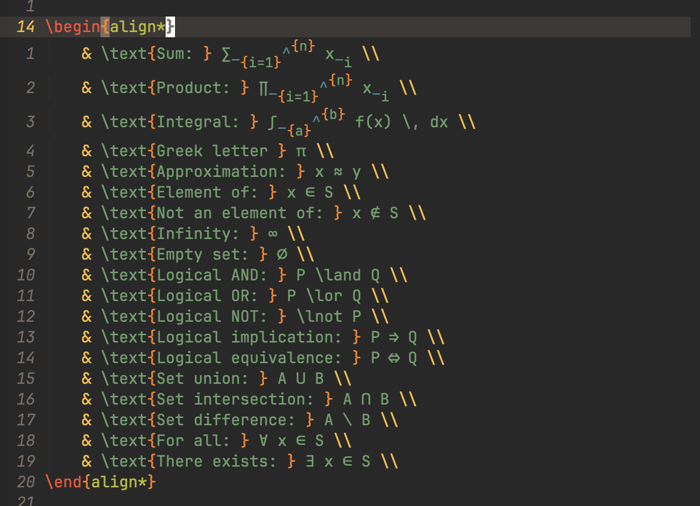

The aim of this post is to show my customised LaTeX setup with Emacs and the packages I used to achieve it.
The configurations I'll be showing will be tailored to [Doom Emacs](https://github.com/doomemacs/doomemacs), as that's what I'm using.
However, all of this is possible in vanilla Emacs.
This guide assumes basic knowledge of both Emacs and LaTeX.
<!--more-->

## AUCTeX
<!--TODO add auto insert braces-->

[AUCTeX](https://www.gnu.org/software/auctex/) can be enabled by enabling `:lang latex` in your `doom` block.

It has a lot of features, however, many of these features are replaced by other packages mentioned later in this guide.
Here are some of the notable features that I use:

### Live Preview

You can enable the live preview by typing <kbd>C-c C-c</kbd> and then selecting the `View` option.
This will open the file in your preferred pdf-viewer and automatically update when you recompile your document (more on compiling later in the guide).

Since I prefer to stay inside emacs, I set my pdf viewer to `pdf-tools` by adding the following to my `config.org`:

```emacs-lisp
(setq +latex-viewers '(pdf-tools))
```

Here's what it looks like:

<video autoplay loop muted playsinline width="100%">
  <source src="preview.webm" type="video/webm">
  <source src="preview.mp4" type="video/mp4">
  Your browser does not support the video tag or the file format of this video.
</video>

### Pretty Symbols

This is a minor mode that displays text like `\gamma` with their unicode equivalents (γ) in math mode.
The underlying text does not change, only the way they are displayed in the editor changes to make equations more readable.
It is enabled by default in Doom Emacs, otherwise you can run `M-x prettify-symbols-mode`.

Here's what it looks like:



### Text Folding

You can remove some of the visual noise in a LaTeX buffer by enabling `TeX-fold-mode`.
This is also enabled by default in Doom Emacs.

This is easier to show than to explain:

<video autoplay loop muted playsinline width="100%">
  <source src="tex-folding.webm" type="video/webm">
  <source src="tex-folding.mp4" type="video/mp4">
  Your browser does not support the video tag or the file format of this video.
</video>

## CDLaTeX

[CDLaTeX](https://github.com/cdominik/cdlatex) is a minor mode supporting fast insertion of environment templates and math stuff in LaTeX.[^1]

[^1]: <https://github.com/cdominik/cdlatex/blob/master/README>

You can enable this by adding the `+cdlatex` flag to the latex section of your `doom` block, like:

```emacs-lisp
(latex +cdlatex)
```

CDLaTeX also has a ton of features, but here are the ones I use the most:

### Abbreviations

Abbreviation expansion is triggered with <kbd>TAB</kbd>, for example:

<video autoplay loop muted playsinline width="100%">
  <source src="abbreviations.webm" type="video/webm">
  <source src="abbreviations.mp4" type="video/mp4">
  Your browser does not support the video tag or the file format of this video.
</video>

Use `M-x cdlatex-command-help` to see a full list of abbreviations.

### Mathematical Symbols

Backquote followed by any character inserts a LaTeX math macro into the buffer.
If necessary, a pair of `\(` is inserted to switch to math mode.
For example, typing `` `a`` inserts `\(\alpha\)`.

You can wait a second after pressing `` ` `` and a list of all the available macros will pop up.
The macros can also be customised with the `cdlatex-math-symbol-alist` variable.

<video autoplay loop muted playsinline width="100%">
  <source src="math-symbols.webm" type="video/webm">
  <source src="math-symbols.mp4" type="video/mp4">
  Your browser does not support the video tag or the file format of this video.
</video>

### Accents and Fonts

Putting accents on mathematical characters and/or changing the font of a character uses key combinations with the quote character `'` as a prefix.
The accent or font change is applied to the character or LaTeX macro **before** point.

<video autoplay loop muted playsinline width="100%">
  <source src="accents.webm" type="video/webm">
  <source src="accents.mp4" type="video/mp4">
  Your browser does not support the video tag or the file format of this video.
</video>

## LatexMk

[Latexmk](https://ctan.org/pkg/latexmk) automates the process of compiling a LaTeX document.
Essentially, it is like a specialized relative of the general make utility, but one which determines dependencies automatically and has
some other very useful features.[^2]

[^2]: https://mirror.ufs.ac.za/ctan/support/latexmk/latexmk.pdf

You can enable it by adding the `+latexmk` flag to `latex` in your `doom` block.
So it should look something like this if you're using [cdlatex](#cdlatex) as well:

```emacs-lisp
(latex +cdlatex +latexmk)
```

<!--TODO ass continuous build-->

When you build your LaTeX project for the first time using _latexmk_, press <kbd>C-c C-c</kbd> and select the `LatexMk` option.
After that, you can build it with `C-c C-a`.

<video autoplay loop muted playsinline width="100%">
  <source src="latexmk.webm" type="video/webm">
  <source src="latexmk.mp4" type="video/mp4">
  Your browser does not support the video tag or the file format of this video.
</video>

## LSP

[LSP](https://github.com/Microsoft/language-server-protocol/ "Language Server Protocol") is a communication protocol used between an integrated development environment (IDE) or code editor and a language server that provides language-specific analysis, autocompletion, diagnostics, and other language-related features for programming.

You can enable [lsp-mode](https://github.com/emacs-lsp/lsp-mode/) for Doom Emacs by enabling the `:tools lsp` module in your `doom` block.

You can view a list of useful lsp-mode features [here](https://emacs-lsp.github.io/lsp-mode/tutorials/how-to-turn-off/).

To enable lsp-mode for LaTeX, add the `+lsp` flag to `latex` in your `doom` block.
Your `doom` block will look like this by now:

```emacs-lisp
(latex +cdlatex +latexmk +lsp)
```

Additionally, you'll also need a language server for LaTeX installed.
The two most popular ones are [TexLab](https://github.com/latex-lsp/texlab) and [Digestif](https://github.com/astoff/digestif).
The choice between the two ultimately comes down to personal preference, and you'll have to look at their features and decide for yourself which one you prefer.
I prefer TexLab, but it you want to use Digestif instead, you can add the following line to your `config.el`:

```emacs-lisp
(setq lsp-tex-server 'digestif)
```

## Xenops

[Xenops](https://github.com/dandavison/xenops) is a LaTeX editing environment for mathematical documents in Emacs.

You can install it by adding `(package! xenops)` to your `packages.el`.
To enable it in a `LaTeX` buffer, run `M-x xenops-mode`.
If you would like to enable it automatically in `LaTeX` buffers, add the following line to your `config.el`:

```emacs-lisp
(add-hook LaTeX-mode-hook #'xenops-mode)
```

Here are some of the notable features of Xenops:

### Render Maths, Tables and TikZ Diagrams

Xenops replaces the `preview-latex` functionality in auctex, which does not seem to support rendering images as SVGs.

<video autoplay loop muted playsinline width="100%">
  <source src="xenops-render.webm" type="video/webm">
  <source src="xenops-render.mp4" type="video/mp4">
  Your browser does not support the video tag or the file format of this video.
</video>

### Paste Images from the Clipboard

Simply run `M-x xenops-image-handle-paste` to paste an image from the clipboard into your document.

<video autoplay loop muted playsinline width="100%">
  <source src="xenops-paste.webm" type="video/webm">
  <source src="xenops-paste.mp4" type="video/mp4">
  Your browser does not support the video tag or the file format of this video.
</video>

## YASnippet

[YASnippet](https://github.com/joaotavora/yasnippet) is a template system for Emacs.
It allows you to type an abbreviation and automatically expand it into function templates when pressing <kbd>TAB</kbd>.

You can install YASnippet by enabling `:editor snippets` in your `doom` block.

Some useful snippets can be found [here](https://github.com/doomemacs/snippets).

<video autoplay loop muted playsinline width="100%">
  <source src="snippets.webm" type="video/webm">
  <source src="snippets.mp4" type="video/mp4">
  Your browser does not support the video tag or the file format of this video.
</video>

Note that [CDLaTeX](#cdlatex) also has snippet functionaly for LaTeX.
If the same snippet is defined in both CDLaTeX and YASnippet, you'll probably want to use the CDLaTeX snippet, so add the following line to your `config.el`:

```emacs-lisp
(map! :map cdlatex-mode-map
      :i "TAB" #'cdlatex-tab)
```

## GNU Calc

[Calc](https://www.gnu.org/savannah-checkouts/gnu/emacs/manual/html_node/calc/index.html#SEC_Contents) is a calculator that's part of Emacs.
It can do symbolic differentiation, linear algebra, taylor series expansions, among many other things.

You can start calc in embedded mode by running `M-x calc-embedded` and perform operations on LaTeX equations.
Here's an example of me finding the taylor series expansion of _e<sup>x</sup>_ to 6 terms:

<video autoplay loop muted playsinline width="100%">
  <source src="gnu-calc.webm" type="video/webm">
  <source src="gnu-calc.mp4" type="video/mp4">
  Your browser does not support the video tag or the file format of this video.
</video>

## evil-tex

[evil-tex](https://github.com/iyefrat/evil-tex) provides a number of useful features for [evil](https://github.com/emacs-evil/evil) users.
This should also be installed by default in Doom Emacs.

Here's an example of me using it:

<video autoplay loop muted playsinline width="100%">
  <source src="evil-tex.webm" type="video/webm">
  <source src="evil-tex.mp4" type="video/mp4">
  Your browser does not support the video tag or the file format of this video.
</video>

## Ackowledgement

Thanks to these articles for inspiring this post:

- <https://castel.dev/post/lecture-notes-1/>
- <https://karthinks.com/software/latex-input-for-impatient-scholars/>
- <https://ejenner.com/post/latex-emacs/>
