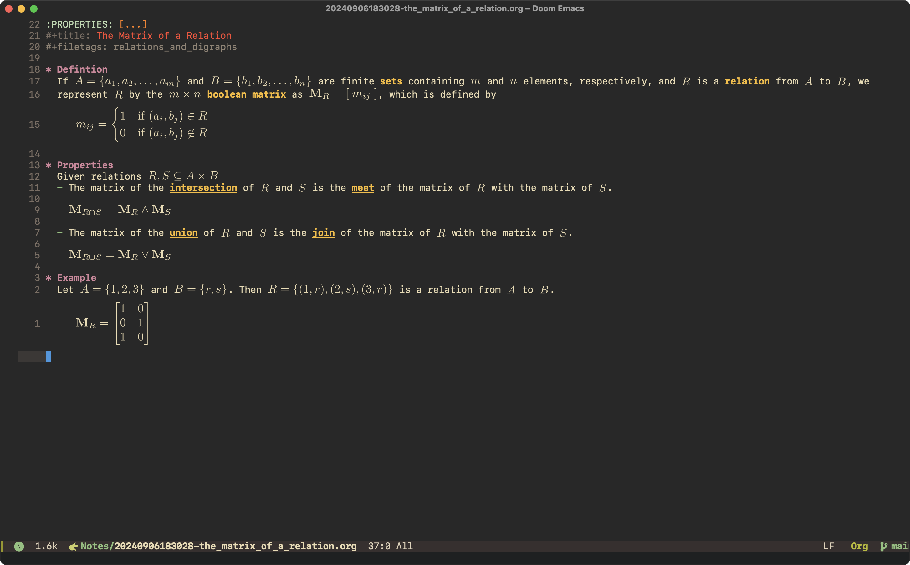

The aim of this post is to show how I use [Doom Emacs](https://github.com/doomemacs/doomemacs)
and [org-roam](https://www.orgroam.com/) to take notes for my Computer Science degree.
<!--more-->

## Introduction

This system has become an essential part of my workflow, and I hope sharing it might help others with 
studies or gain new ideas for managing information.
There’s a comment section at the bottom of this post where you can share your questions or feedback. 
You’ll need a GitHub account to sign in, but your comments could be valuable to others who come across this post. 
If you’d rather not comment there, that’s fine too --- I appreciate your engagement regardless.

Some people have expressed interest in actually seeing my notes, so I've decided to 
make [all of my notes](https://notes.michaelneuper.com/) publicly available for free.
However, please note that there are no images or attachments included due to copyright considerations 
involving university materials, textbooks, and other online resources.
There also seems to be an issue where LaTeX is not displaying correctly.
I have opened [an issue on GitHub](https://github.com/ikoamu/publish-org-roam-ui/issues/34) about this
and am also working on trying to fix it myself.

These notes are far from perfect and they almost certainly contain errors, inconsistencies,
or things I simply missed.
They are all stored on [this GitHub repo](https://github.com/michaelneuper/notes),
so feel free to submit a pull request if you spot any.
Collaboration is always welcome!

## Why Org-Roam?

### Integration with Emacs

As someone deeply embedded in the emacs ecosystem, I rely on it for almost everything:
from writing code and managing tasks to organising my academic and personal life. 
It’s my one-stop shop for productivity, and I find its flexibility unmatched. 
Naturally, when it came to note-taking, I needed something that could integrate seamlessly into my 
existing workflow without breaking the context-switching-free experience that emacs offers.

### Org Mode

Using org-roam means that I get all the benefits of org mode, more about this in [5](#code-and-latex-in-notes).

### Plain Text

One of my core requirements for a note-taking system is that my notes must be stored in plain text format. 
Plain text is _timeless_, _portable_, and _future-proof_.
Unlike proprietary formats or specialised software, plain text notes can be read, edited, and processed 
by almost any text editor or tool, so that my work remains accessible decades from now.

## How I Structure my Notes

At the heart of my system is a main index node, which serves as a centralised hub containing links to all my classes.
For example:
```org
* Year 1
** Semester 1
*** Class 1
*** Class 2
** Semester 2
...
```

Each class has its own dedicated node, linked from the main index. 
The structure within each class node depends on how the lecturer organises their material.
I tailor the hierarchy of my notes to match the specific course structure, so that I can easily 
relate my notes to the lectures' notes/slides. 
Here are two common examples of how I structure my class notes:

### Week -> Lecture -> Topics

Some professors organise their lecture notes/slides by week, with a separate pdf for each lecture.
So a typical class note might look like:
```org
* Week 1
** Lecture 1
*** Topic 1
*** Topic 2
** Lecture 2
...
```

### Chapter -> Topics

Some professors follow the structure of the textbook, with a pdf for every chapter.
So a class note might look like:
```org
* Chapter 1
** Topic 1
** Topic 2
...
```

Topic nodes then link to other topic nodes, or other nodes which are not topic nodes (a node need not be connected to a class node).
Here is what a topic node might look like:



## When I Take Notes

I’ve found that taking notes during the lecture itself offers little benefit, at least for me. 
During lectures, you’re often just scrambling to keep up with the lecturer, copying down what they’re writing without 
really processing or understanding the material. 
Since lecture notes are usually available afterward, this feels like a pointless exercise.

Instead, I prefer to **listen attentively during the lecture** and focus on understanding the concepts being taught. 
By concentrating on the explanations and examples, I can grasp the material more effectively without the distraction of 
trying to transcribe everything in real-time.

At the end of the day, once I’m home and have some quiet time, I sit down to make my own notes. 
By then, I’ve already formed a basic understanding of the topic from the lecture. 
I start by writing down what I remember from class, which helps reinforce the key points. 
If I realise I’ve forgotten something or need clarification, I consult the textbook, lecture notes, or other resources to fill in the gaps.

This approach has several benefits:
1. **Reinforcement of Knowledge**: Revisiting the material shortly after hearing it helps solidify what I learned during the lecture. 
    It’s like giving my brain a second chance to process the information.
2. **Preparation for Homework**: Writing the notes serves as a quick refresher on the day’s work, 
    which is particularly helpful when tackling homework or assignments based on the lecture content.
3. **Deeper Understanding**: By writing notes in my own words and structuring them in a way that makes sense to me, 
    I engage more actively with the material. 
    This process helps me gain a better understanding of the concepts than if I had simply copied the lecturer’s words verbatim.

Ultimately, this method allows me to focus on comprehension during the lecture and use my note-taking time to consolidate 
and deepen my understanding of the material. 
It’s a system that not only works well for my learning style but also ensures that my notes are meaningful and useful for future review.

## Code and LaTeX in Notes

When it comes to incorporating code and LaTeX into my notes, org-roam combined with the functionality of org mode provides 
everything I need for a seamless and powerful workflow.

### LaTeX

For LaTeX rendering, I use the [Xenops](https://github.com/dandavison/xenops) package instead of org mode’s default LaTeX preview system. 
Here’s why:
1. **Asynchronous Rendering**: Xenops renders LaTeX fragments asynchronously, meaning I can continue writing without being interrupted by rendering delays. This is especially useful when working with complex equations that take longer to render.
2. **Caching for Efficiency**: Once a LaTeX fragment is rendered, Xenops caches the result. This means fragments that have already been rendered don’t need to be processed again, saving time and avoiding unnecessary CPU usage.

For those interested in setting up and configuring LaTeX for emacs, I’ve written a [separate blog post](https://michaelneuper.com/posts/efficient-latex-editing-with-emacs/) that goes into greater detail about working with LaTeX in emacs,
most of it applies to using LaTeX in org mode as well.

### Code

Org mode’s native functionality makes it ideal for including and executing code directly within my notes. 
Here’s how I leverage it:
1. **Code Blocks**: I use org mode’s code block syntax to include code snippets directly in my notes. 
    This allows me to document algorithms, explain concepts with examples, and even run the code inline when needed.

    ```python
    #+begin_src python
    def binary_search(arr, target):
        left, right = 0, len(arr) - 1
        while left <= right:
            mid = (left + right) // 2
            if arr[mid] == target:
                return mid
            elif arr[mid] < target:
                left = mid + 1
            else:
                right = mid - 1
        return -1
    #+end_src
    ```

2. **Tangle Feature**: With org mode’s tangling functionality, I can export code snippets into standalone files. 
    This is useful for assignments or projects where I need to test or submit my code outside of emacs.

3. **Syntax Highlighting and Evaluation**: org mode supports syntax highlighting for various programming languages and allows for inline execution, making it easy to test small snippets of code directly within my notes.

The ability to use both code and LaTeX within org mode gives me a significant advantage when documenting complex topics. 
For example, I can create a note on an algorithm like Dynamic Programming, where:
- A code block demonstrates the implementation.
- LaTeX fragments explain the mathematical formulation and recurrence relations.
- All of this is interconnected with links to related notes, such as "Time Complexity".

## How I View my Notes

When it comes to reviewing and navigating my notes, I’ve experimented with both [org-roam-ui](https://github.com/org-roam/org-roam-ui) (ORUI) and emacs itself.
Over time, my workflow has shifted toward using emacs almost exclusively, but ORUI was an important part of my note-viewing process for a long time.

ORUI generates a pretty graph based on the links between nodes; here is my graph after one year:


ORUI also generates previews of your notes, and this is what I initially used to review my notes.
The main reason was because of how slow LaTeX previews in org mode are, but xenops has fixed that issue.

But ORUI also has limitations that made me gravitate toward emacs for reviewing notes:
- **No Search Functionality**: Unlike emacs, ORUI doesn’t offer a way to search through notes. 
  Instead, you have to find notes by clicking on nodes on the graph, which becomes impractical as the graph grows.
- **Improper Table Rendering**: Tables in Org mode didn’t render well in ORUI, which made it harder to use tables effectively.
- **No Code Highlighting:** As a computer science student, code snippets are a big part of my notes, and 
  ORUI doesn’t support syntax highlighting for code blocks.

## Setting up Doom Emacs for Org-Roam

For xenops to be able to render the mathematical symbols I need, I have to add the following LaTeX packages:

```elisp
(after! org
  (add-to-list 'org-latex-packages-alist '("" "amsmath" t))
  (add-to-list 'org-latex-packages-alist '("" "amssymb" t))
  (add-to-list 'org-latex-packages-alist '("" "mathtools" t))
  (add-to-list 'org-latex-packages-alist '("" "mathrsfs" t)))
```

I let xenops automatically render LaTeX fragments when opening an org file and set the scale factor according to my display:

```elisp
(add-hook 'org-mode-hook #'xenops-mode)
(setq xenops-math-image-scale-factor 1.7
      xenops-reveal-on-entry t)
```

I use the following keybindings for Org-roam:

```elisp
(map! :map evil-org-mode-map
        :leader
        (:prefix ("r")
         :desc "Insert node"
         "i" #'org-roam-node-insert
         :desc "Find node"
         "f" #'org-roam-node-find
         :desc "Capture to node"
         "c" #'org-roam-capture
         :desc "Toggle roam buffer"
         "b" #'org-roam-buffer-toggle
         :desc "Open random note"
         "r" #'org-roam-node-random
         :desc "Visit node"
         "v" #'org-roam-node-visit
         :desc "Open ORUI"
         "u" #'org-roam-ui-open))
```

If you're interested in seeing my entire config, it is available in [this GitHub repo](https://github.com/michaelneuper/doom).
