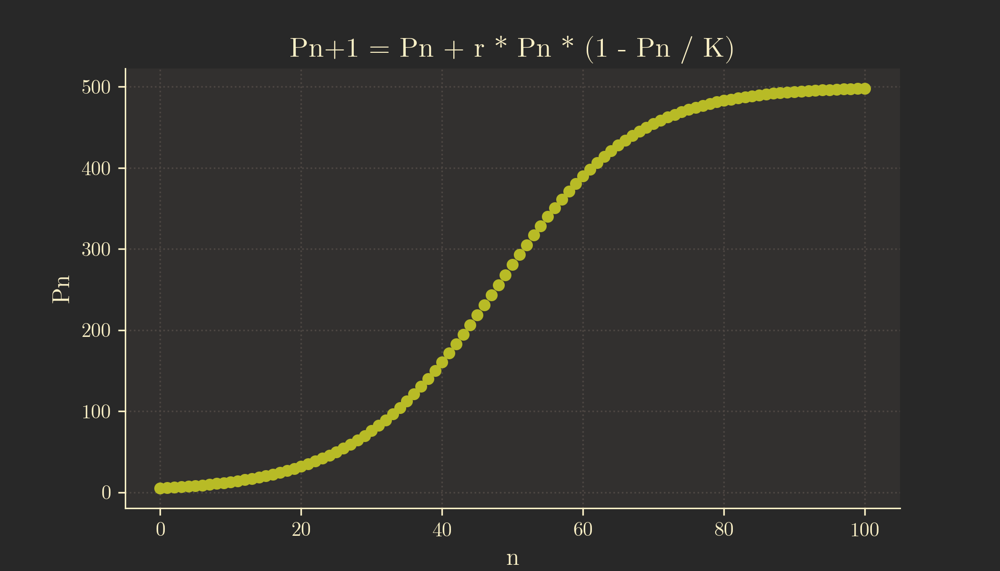
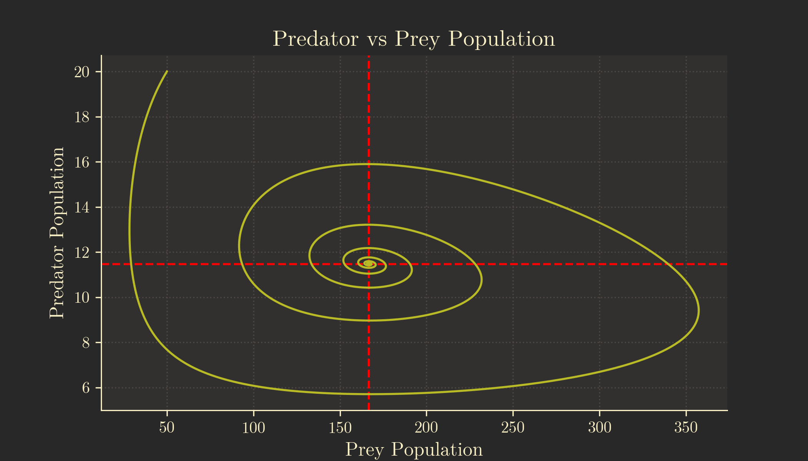
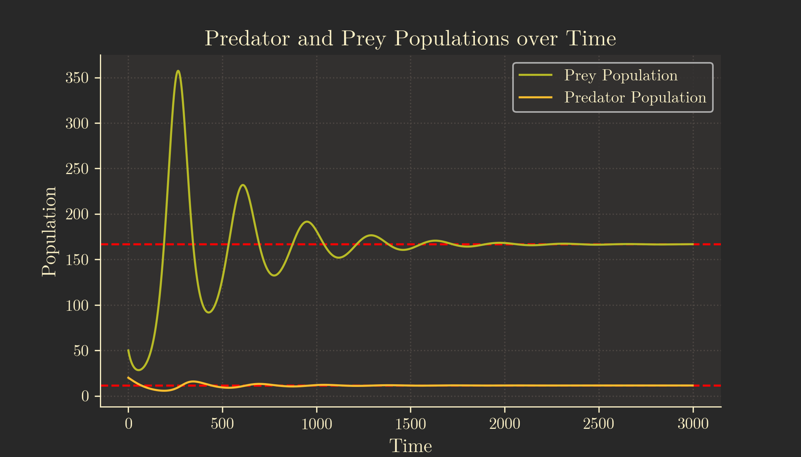

In this guide we will be modelling population growth using both the Logistic Model[^1] and the Lotka–Volterra (or Predator-Prey) Model[^2] in python and plotting it with `matplotlib`.
If you would just like the python code, you can download the code for the Logistic Model [here](logistic.py) and the code for the Lotka-Volterra Model [here](predator-prey.py).

[^1]: Logistic function <https://en.wikipedia.org/wiki/Logistic_function>
[^2]: Lotka–Volterra equations <https://en.wikipedia.org/wiki/Lotka-Volterra_equations>
<!--more-->

## Logistic Growth

### The Logistic Equation

The logistic equation is commonly expressed as a differential equation:

$$
\frac{\text{d}P}{\text{dt}} = rP\left(1 - \frac{P}{K}\right)
$$

However, for our purposes, we'll use the recurrence relation[^3] form:

[^3]: Recurrence relation <https://en.wikipedia.org/wiki/Recurrence_relation>

$$
P_{n+1} = P_n + rP_n\left(1 - \frac{P_n}{K}\right)
$$

where:

- $n$ is the cycle
- $P_n$ is the population after $n$ cycles
- $r$ is the intrinsic growth rate
- $K$ is the carrying capacity

The recurrence relation is suitable for scenarios where population counts are measured at discrete intervals, aligning well with real-world data.
It is also easier to implement in Python.

### Variables

Let's set up the variables and import the necessary libraries in Python:

```py
import matplotlib.pyplot as plt
import numpy as np

p_0 = 5 # initial population
r = 0.1 # intrinsic growth rate
K = 500 # carrying capacity
n = 100 # number of cycles
```

Feel free to experiment with these variables to observe changes in the graphs.

### Model the Population

Now, let's create a Python function based on the logistic equation:

```py
def p_n():
    populations = [p_0]

    for i in range(n):
        p_n = populations[i]
        p_n1 = p_n + r * p_n * (1 - p_n / K)
        populations.append(p_n1)

    return populations
```

This function generates an array, `populations`, storing the population density after each cycle.

### Plotting the Population vs Time Graph

Utilising the `matplotlib` library, we can create a graph where $x$ represents each cycle (`n`) and $y$ represents the population density after $n$ cycles:

```py
def plot_p_n():
    x = list(range(n + 1))
    y = p_n()

    plt.figure(1)
    plt.plot(x, y, 'o')
    plt.xlabel('n')
    plt.ylabel('Pn')
    plt.title('Pn+1 = Pn + r * Pn * (1 - Pn / K)')
```

This code produces a plot illustrating population growth over time.



Note that the graph is not continuous, since we are plotting the graph over discrete time intervals ($n$).

### Plotting the Change in Population vs Population Graph

Next, we calculate the change in population after each cycle using the logistic equation:

$$
rP_n\left(1 - \frac{P_n}{K}\right)
$$

```py
def delta_p_p(P):
    return r * (1 - P / K)
```

We then create a function to plot $\Delta P / P$ against $P$, including a regression line:

```py
def plot_delta_p_p():
    x = p_n()
    y = []
    for i in range(1, n):
        delta_p = (x[i + 1] - x[i - 1]) / 2
        y.append(delta_p / x[i])
        
    del x[0]
    del x[-1]

    x_reg = np.linspace(0, x[-1], 2)
    y_reg = delta_p_p(x_reg)

    plt.figure(2)
    plt.plot(x, y, 'o')
    plt.plot(x_reg, y_reg)
    plt.xlim(0, K)
    plt.ylim(0, r)
    plt.xlabel('Pn')
    plt.ylabel('∆P/P')
    plt.title('∆P/P = r * (1 - P / K)')
```

This code generates a plot depicting the relationship between the change in population and the population size.


### Showing the Plots

Finally, we display our graphs by calling the functions:

```py
plot_p_n()
plot_delta_p_p()
plt.show()
```

## Lotka–Volterra

### The Lotka-Volterra Equations

The Lotka-Volterra equations are also commonly expressed in their differential form:

$$
\frac{\text{d}x}{\text{d}t} = \alpha x - \beta xy
$$

$$
\frac{\text{d}y}{\text{d}t} = \delta xy - \gamma y
$$

However, for the same reasons, I'll use their recurrence relation counterparts.
I'll also use $a$, $b$, $c$ and $f$ instead of $\alpha$, $\beta$, $\delta$ and $\gamma$.
Additionally, I'll use $R_n$ (for "rabbits") to represent the prey population, and $F_n$ (for "foxes") to represent the predator population.
This is more intuitive to use than $x$ and $y$ in my opinion.

$$
R_{n+1} = R_n + aR_n\left(1-\frac{R_n}{K}\right) - bR_nF_n
$$

$$
F_{n+1} = F_n + fbR_nF_n - cF_n
$$

where:

- $n$ is the cycle
- $R_n$ is the prey population after $n$ cycles
- $F_n$ is the predator population after $n$ cycles
- $a$ is the intrinsic growth rate of the prey
- $K$ is the carrying capacity of the prey
- $b$ is the rate at which the predators kill the prey
- $f$ is the effectiveness with which the predators can turn the prey into food
- $c$ is the natural per-capita death rate of the predators

### Assumptions

We'll assume that:
- The predators only die from natural causes
  - i.e. the predators are not hunted by a bigger predator
- The prey only die from predators killing them
  - i.e. the prey will be killed before dying of natural causes such as age


### Variables

Let's implement these variables in Python, along with necessary libraries for graph plotting:

```py
import matplotlib.pyplot as plt
import numpy as np

cycles = 3000 # number of cycles

# Prey
R_0 = 50 # initial population
a = 0.04 # intrinsic growth rate
K = 1200 # carrying capacity
b = 0.003 # per-capita attack rate of predators on prey

# Predators
F_0 = 20 # initial population
c = 0.01 # natural death rate
f = 0.02
```

Feel free to play around with these variables to see how the graphs change.

Additionally, we'll initialise arrays for the prey populations and predators populations with the value of their initial populations. These are called `prey_population` and `predator_population`, respectively.

We'll also create a variable called `marker_size`, which will be the size of the marker in our plots. This will make it easier to change the marker size of all our plots down the line.

```py
prey_population = [R_0]
predator_population = [F_0]
marker_size = 2
```

### Model the Prey Population

Let's create a function to model the prey population according to the Lotka-Volterra equation:

```py
def R(n):
    R_n = prey_population[n - 1]
    F_n = predator_population[n - 1]

    return R_n + a * R_n * (1 - R_n / K) - b * R_n * F_n
```

### Model the Predator Population

Similarly, we model the predator population:

```py
def F(n):
    R_n = prey_population[n - 1]
    F_n = predator_population[n - 1]

    return F_n + f * b * R_n * F_n - c * F_n
```

### Cycle Over the Populations

A function to model both predator and prey populations over `n` cycles:

```py
def model():
    for i in range(1, cycles):
        prey_population.append(R(i))
        predator_population.append(F(i))
```

### Getting the Equilibrium Populations

To show how each of the populations tend toward equilibria on our graphs, we might want to define some variables for the equilibrium populations.

```py
R_e = c / (b * f)
F_e = (a / b) * (1 - R_e / K)
```

where `R_e` is the equilibrium prey population and `F_e` is the equilibrium predator population

We can derive these formulae by setting $R_{n+1}=R_n$ and $F_{n+1}=F_n$, which will yield the following:

$$
R_e = \frac{c}{bf}
$$

$$
F_e = \frac{a}{b}\left(1 - \frac{R_e}{K}\right)
$$

### Plotting the Predator vs Prey Population Graph

Using `matplotlib`, we plot the graph with their equilibria:

```py
def plot_predator_prey():
    plt.figure(1)
    plt.axvline(x=R_e, color='red', linestyle='--')
    plt.axhline(y=F_e, color='red', linestyle='--')
    plt.plot(prey_population, predator_population, markersize=marker_size)
    plt.xlabel('Prey Population')
    plt.ylabel('Predator Population')
    plt.title('Predator vs Prey Population')
```

This produces a graph depicting the predator-prey interaction:



As can be seen on the plot, the graph spirals toward the intersection of the equilibria.

### Plotting the Populations vs Time Graph

Plot the populations against time, including horizontal lines for equilibrium:

```py
def plot_population_time():
    plt.figure(2)
    plt.axhline(y=F_e, color='red', linestyle='--')
    plt.axhline(y=R_e, color='red', linestyle='--')
    plt.plot(np.arange(cycles), prey_population, label='Prey Population', markersize=marker_size)
    plt.plot(np.arange(cycles), predator_population, label='Predator Population', markersize=marker_size)
    plt.ylabel('Population')
    plt.xlabel('Time')
    plt.title('Predator and Prey Populations over Time')
    plt.legend()
```

The resulting graph illustrates the populations approaching equilibrium:



### Showing the Plots

Call the functions to display the plots:

```py
model()
plot_predator_prey()
plot_population_time()
plt.show()
```
